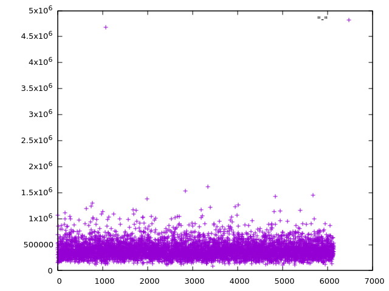

# Ros2TraceAnalyzer

Ros2TraceAnalyzer is a fast command-line tool to extract useful data from LTTng traces of ROS applications.

## Supported ROS versions

- Jazzy

## Installation

First make sure you have development version of Babeltrace 2 library
and clang development files. On Ubuntu, it can be installed  using:

```sh
apt install libbabeltrace2-dev libclang-dev
```

The Ros2TraceAnalyzer can then be compiled and installed using `cargo` by running:

```sh
cargo install --git https://github.com/skoudmar/Ros2TraceAnalyzer.git
```

Compilation should work with at least Rust version 1.90. Currently, we
don't make any guarantees for minimum supported Rust version (MSRV).

## Usage

Record traces of your ROS application:

- Either by installing [`ros2trace`][] and running:

  ```sh
  ros2 trace -u 'ros2:*' 'r2r:*'
  ```

  The traces will be available in `$HOME/.ros/tracing/session-<timestamp>`.

- Alternatively, you can trace your application directly with LTTng:

  ```sh
  # Session name is an optional user-chosen name for the trace
  lttng create [session-name]
  lttng enable-event -u 'ros2:*,r2r:*'
  lttng add-context -u --type=vtid --type=vpid --type=procname
  lttng start
  # Start the ROS system here.
  # Let it run for as long as you want to trace it.
  lttng destroy
  ```

  The traces will be available in `$HOME/lttng-traces/<session-name>-<timestamp>`.

Then you can use `Ros2TraceAnalyzer` subcommands to obtain various
information from the trace.

<!-- `$ cargo run -- -h | sed 's/ \[default:/\n          \[default:/g'` -->

```
Usage: Ros2TraceAnalyzer [OPTIONS] <COMMAND>

Commands:
  analyze  Analyze a ROS 2 trace and generate graphs, JSON or bundle outputs
  chart    Render a chart of a specific property of a ROS 2 interface
  viewer   Start a .dot viewer capable of generating charts on demand
  help     Print this message or the help of the given subcommand(s)

Options:
  -v, --verbose...  Increase logging verbosity
  -q, --quiet...    Decrease logging verbosity
  -h, --help        Print help
```

## Analyze
This command analyzes the traces and saves relevant information for later use into JSON, TXT and DOT files. 

```
Analyze a ROS 2 trace and generate graphs, JSON or bundle outputs

Usage: Ros2TraceAnalyzer analyze [OPTIONS] <TRACE_PATHS>...

Arguments:
  <TRACE_PATHS>...
          Paths to directories to search for the trace to analyze
          
          All subdirectories are automatically searched too.

Options:
      --all
          Run all analyses with their default output filenames
          
          The output `filename` can be changed by specific analysis option.
          
          This is enabled by default unless specific analysis option is provided.

  -v, --verbose...
          Increase logging verbosity

      --dependency-graph[=<FILENAME>]
          Construct a detailed dependency graph with timing statistics in DOT format

  -q, --quiet...
          Decrease logging verbosity

      --message-latency[=<FILENAME>]
          Analyze the latency of messages

      --callback-duration[=<FILENAME>]
          Analyze the callback duration and inter-arrival time

      --callback-publications[=<FILENAME>]
          Analyze the publications made by callbacks

      --callback-dependency[=<FILENAME>]
          Generate a callback dependency graph in DOT format

      --message-take-to-callback-latency[=<FILENAME>]
          Analyze the latency between message take and callback execution

      --utilization[=<FILENAME>]
          Analyze system utilization based on quantile callback durations

      --real-utilization[=<FILENAME>]
          Analyze system utilization based on real execution times

      --spin-duration[=<FILENAME>]
          Analyze the duration of executor spins

  -o, --out-dir <OUT_DIR>
          Directory to write output files
          
          If not provided, the current working directory is used.
          
          When analysis output filename is specified and it is not an absolute path, it is resolved relative to `OUT_DIR`.

      --quantiles <QUANTILES>
          Quantiles to compute for the latency and duration analysis.
          
          The quantiles must be in the range [0, 1].
          
          If not specified, the default quantiles are: 0 (minimum), 0.10, 0.5 (median), 0.90, 0.99, 1 (maximum)
          
          [default: 0,0.10,0.5,0.90,0.99,1]

      --utilization-quantile <QUANTILE>
          Callback duration quantile to use for utilization analysis
          
          [default: 0.9]

      --thickness
          Set the edge thickness in dependency graph based on its median latency

      --color
          Color edge in dependency graph based on its median latency

      --min-multiplier <MIN_MULTIPLIER>
          Minimum multiplier for edge coloring or thickness.
          
          Can be any positive number.
          
          The minimum multiplier is used to set the maximum value in gradients to be at least `MIN_MULTIPLIER` times the minimum value.
          
          The gradient range is exactly [minimum value, max(maximum value, minimum value * `MIN_MULTIPLIER`)].
          
          [default: 5.0]

      --exact-trace-path
          Only the directories specified by `TRACE_PATHS` are searched for traces, not their subdirectories

  -h, --help
          Print help (see a summary with '-h')

```

To gain **overview of timing in your application**, generate a
dependency graph and view it with [xdot.py][]:

```sh
Ros2TraceAnalyzer analyze ~/lttng-traces/session-20240123-123456 --dependency-graph -o graph/ --thickness
xdot graph/dependency_graph.dot
```

You will see something similar to this figure, where tooltips show
quantiles of measured timing parameters:


> [!NOTE]
> Latest xdot relase (1.4) doesn't display newlines in tooltips
> correctly. To see tooltips correctly, use the master branch.

Selected options for dependency-graph:
- `-o, --output-dir <DIR>` Mandatory option specifying the output
  directory for the graph
- `--color` Color edges based on their median latency
- `--thickness` Set edge thickness based on their median latency
- `--min-multiplier <MIN_MULT>` Set the maximum value of the color or
  thickness range to be lower bounded by `MIN_MULT` multiple of the
  minimum value, i.e. the range will be: [min, _max_(max, min *
  `MIN_MULT`)]

**Message latency** and **Callback** analyze message latencies and
callback execution and inter-arrival times. The resulting data can be
printed to stdout in aggregated form or exported in full to a JSON
file. Supported options are:

- `--quantiles <QUANTILES>...` Print results with these quantiles.

You can visualize individual data by using Jupyter notebooks in the
[py-src](./py-src/) directory or directly via command line, for
example, as follows:

```sh
Ros2TraceAnalyzer analyze ~/lttng-traces/session-20240123-123456 --message-latency -o json
jq '.[]|select(.topic=="/clock" and .subscriber_node=="/rviz2")|.latencies[]' json/message_latency.json | gnuplot -p -e 'plot "-"'
```



**Utilization** analysis allow to estimate CPU utilization by
individual threads for different quantiles of callback execution
times. To analyze theoretical worst-case utilization, add `--quantile 1.0`. For median utilization, use `--quantile 0.5`.

Example output of utilization analysis is shown below:

```sh
Ros2TraceAnalyzer ~/lttng-traces/session-20240123-123456 --utilization --utilization-quantile 0.9
```

```
Utilization statistics for duration quantile 0.9:
Thread 1737160 on steelpick has utilization 19.16940 %
     19.10737 % from Callback (node="/alks", Timer(20 ms))
      0.03355 % from Callback (node="/alks", Subscriber("/clock"))
      0.00598 % from Callback (node="/alks", Subscriber("/FR/EPS/LHEPS04"))
      0.00430 % from Callback (node="/alks", Subscriber("/FR/ZFAS/EML04"))
      0.00398 % from Callback (node="/alks", Subscriber("/FR/ESP_PAG/ESP21"))
      0.00349 % from Callback (node="/alks", Subscriber("/FR/ZFAS/BV2LinienEgoLinks"))
      0.00290 % from Callback (node="/alks", Subscriber("/FR/ZFAS/BV2LinienEgoRechts"))
      0.00269 % from Callback (node="/alks", Subscriber("/joy"))
      0.00265 % from Callback (node="/alks", Subscriber("/FR/ZFAS/BV2LinienNebenspuren"))
      0.00248 % from Callback (node="/alks", Subscriber("/FR/ZFAS/EML01"))
Thread 1737158 on steelpick has utilization  2.10334 %
      0.58935 % from Callback (node="/rviz2", Subscriber("/carla/ego_vehicle/vehicle_status"))
      0.55587 % from Callback (node="/rviz2", Subscriber("/carla/status"))
      0.22955 % from Callback (node="/rviz2", Subscriber("/sensor_stack/cameras/zed2/zed_node/left/image_rect_color"))
      0.20924 % from Callback (node="/rviz2", Subscriber("/alks/goal"))
      0.17058 % from Callback (node="/rviz2", Subscriber("/debug/alks_markers"))
      0.09388 % from Callback (node="/rviz2", Subscriber("/FRviz/lines"))
      0.06875 % from Callback (node="/rviz2", Subscriber("/FRviz/line_labels"))
      0.06213 % from Callback (node="/rviz2", Subscriber("/alks/req_pose"))
      0.05595 % from Callback (node="/rviz2", Subscriber("/sensor_stack/cameras/zed2/zed_node/left/image_rect_color"))
      0.01816 % from Callback (node="/rviz2", Subscriber("/carla/available_scenarios"))
      0.01735 % from Callback (node="/rviz2", Subscriber("/vehicle/status/velocity_status"))
      0.01686 % from Callback (node="/rviz2", Subscriber("/parameter_events"))
      0.01147 % from Callback (node="/rviz2", Subscriber("/vehicle/status/steering_status"))
      0.00419 % from Callback (node="/rviz2", Subscriber("/sensor_stack/cameras/zed2/zed_node/left/camera_info"))
```

> [!NOTE]
> The utilization analysis is based solely on timestamps from ROS
> callbacks. It ignores kernel scheduling events such as context
> switches and other activities executed by the application outside of
> callbacks. Therefore, the result are not guaranteed to be always
> correct. However, they are already useful indication for when
> something goes wrong in your application.

## Chart
This command is reserved for later use. It is intended for generating charts from analyzed traces.

```
Render a chart of a specific property of a ROS 2 interface

Usage: Ros2TraceAnalyzer chart [OPTIONS] --node <NODE> --value <VALUE> <COMMAND>

Commands:
  histogram  
  scatter    
  help       Print this message or the help of the given subcommand(s)

Options:
  -n, --node <NODE>
          Full name of the node to draw the chart for
          
          The name should include the namespace and node's name

  -v, --verbose...
          Increase logging verbosity

  -i, --input-path <INPUT>
          The input path, either a file of the data or a folder containing the default named file with the necessary data

  -q, --quiet...
          Decrease logging verbosity

  -o, --output-path <OUTPUT>
          The output path, either a folder to which the file will be generated or a file to write into

  -c, --clean
          Indicates whether the chart should be rendered from scratch.
          
          If not set, an existing chart will be reused only if it matches all specified parameters.

      --value <VALUE>
          The value to plot into the chart

          Possible values:
          - callback-duration:  Callback execution durations
          - activations-delay:  Delays between callback or timer activations
          - publications-delay: Delays between publisher publications
          - messages-delay:     Delays between subscriber messages
          - messages-latency:   Latency of a communication channel

      --size <SIZE>
          The size of the rendered image in pixels
          
          [default: 800]

      --output-format <OUTPUT_FORMAT>
          The filetype (output format) the rendered image should be in
          
          [default: svg]
          [possible values: svg, png]

  -h, --help
          Print help (see a summary with '-h')
```

## Viewer
This command is reserved for later use. Builtin .dot graphs viewer.
```
Start a .dot viewer capable of generating charts on demand

Usage: Ros2TraceAnalyzer viewer [OPTIONS] <DOTFILE>

Arguments:
  <DOTFILE>  The dotfile to open

Options:
  -v, --verbose...
          Increase logging verbosity
      --viewer <VIEWER>
          The entry point to the python viewer (defaults to ./xdotviewer/main.py)
  -q, --quiet...
          Decrease logging verbosity
  -t, --tracer-exec <Ros2TraceAnalyzer>
          The executable to run to invoke the Ros2TraceAnalyzer (defaults to ./target/release/Ros2TraceAnalyzer)
  -d, --data <DATA>
          The directory with the datafiles (defaults to CWD)
  -h, --help
          Print help
```


[`ros2trace`]: https://index.ros.org/p/ros2trace/
[xdot.py]: https://github.com/jrfonseca/xdot.py

**Acknowledgment:**

This project was co-financed from the state budget by the Technology
agency of the Czech Republic under the project TN01000026 *Božek
Vehicle Engineering National Center of Competence*.

<a href="https://tacr.gov.cz/program/program-narodni-centra-kompetence/"></a>
