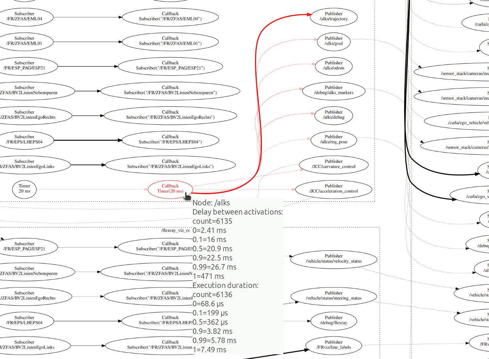

# Ros2TraceAnalyzer

Ros2TraceAnalyzer is a fast command-line tool to extract useful data from LTTng traces of ROS applications.

## Supported ROS versions

- Jazzy

## Installation

First make sure you have development version of Babeltrace 2 library. It can be installed on Ubuntu using:

```sh
apt install libbabeltrace2-dev
```

The Ros2TraceAnalyzer can then be compiled and installed using `cargo` by running:

```sh
cargo install --git https://github.com/skoudmar/Ros2TraceAnalyzer.git
```

Compilation should work with at least Rust version 1.83. Currently, we
don't make any guarantees for minimum supported Rust version.

## Usage

Record traces of your ROS application:

- Either by installing [`ros2trace`][] and running:

  ```sh
  ros2 trace -u 'ros2:*' 'r2r:*'
  ```

  The traces will be available in `$HOME/.ros/tracing/session-<timestamp>`.

- Alternatively, you can trace your application directly with LTTng:

  ```sh
  # Session name is an optional user-chosen name for the trace
  lttng create [session-name]
  lttng enable-event -u 'ros2:*,r2r:*'
  lttng add-context -u --type=vtid --type=vpid --type=procname
  lttng start
  # Start the ROS system here.
  # Let it run for as long as you want to trace it.
  lttng destroy
  ```

  The traces will be available in `$HOME/lttng-traces/<session-name>-<timestamp>`.

Then you can use `Ros2TraceAnalyzer` subcommands to obtain various
information from the trace.

<!-- `$ cargo run -- -h | sed '/Options:/,$ d'` -->

```
Usage: Ros2TraceAnalyzer [OPTIONS] <TRACE_PATHS>... <COMMAND>

Commands:
  dependency-graph  Construct a detailed dependency graph with timing statistics
  message-latency   Analyze the latency of the messages
  callback          Analyze the callback duration and inter-arrival time
  utilization       Analyze the utilization of the system based on the quantile callback durations
  utilization-real  Analyze the utilization of the system based on the real execution times
  all               Run all analyses
  help              Print this message or the help of the given subcommand(s)

Arguments:
  <TRACE_PATHS>...  Paths to directories to search for the trace to analyze

```

To gain overview of timing in your application, generate a dependency
graph and view it with [xdot.py][]:

```sh
Ros2TraceAnalyzer ~/lttng-traces/session-20240123-123456 dependency-graph -o graph/
xdot graph/dependency_graph.dot
```

You will see something similar to this figure:



> [!NOTE]
> Latest xdot relase (1.4) doesn't display newlines in tooltips
> correctly. To see tooltips correctly, use the master branch.

**Detailed dependency graph** options:
```
-o, --output-path <OUTPUT_PATH>   mandatory option specifying the output directory for the graph
--color                           Color edges based on the edge weight.
--thickness                       Set edge thickness based on edge weight.
--min-multiplier <MIN_MULTIPLIER> Set the maximum value of the color or thickness range to be
                                  lower bounded by MIN_MULTIPLIER times the minimum value.
```

**Message latency** and **Callback** analyses options:
```
--quantiles <QUANTILES>...    Print results with these quantiles.
--json-dir  <JSON_DIR_PATH>   Instead of printing aggregated results, export the measured
                              data into a JSON file in the specified directory.
```

**Utilization** analysis option:
```
--quantile <QUANTILE>   Quantile used for callback duration calculation.
```


[`ros2trace`]: https://index.ros.org/p/ros2trace/

[xdot.py]: https://github.com/jrfonseca/xdot.py
